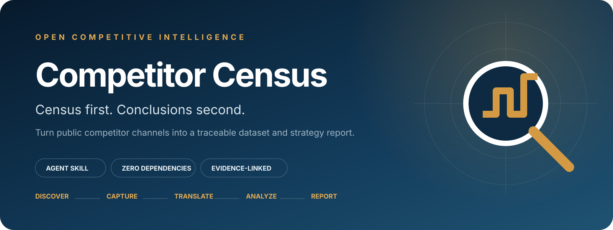
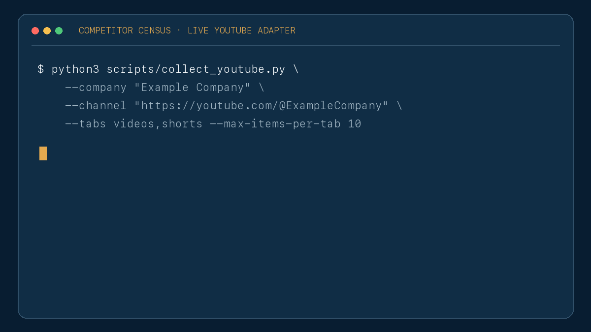
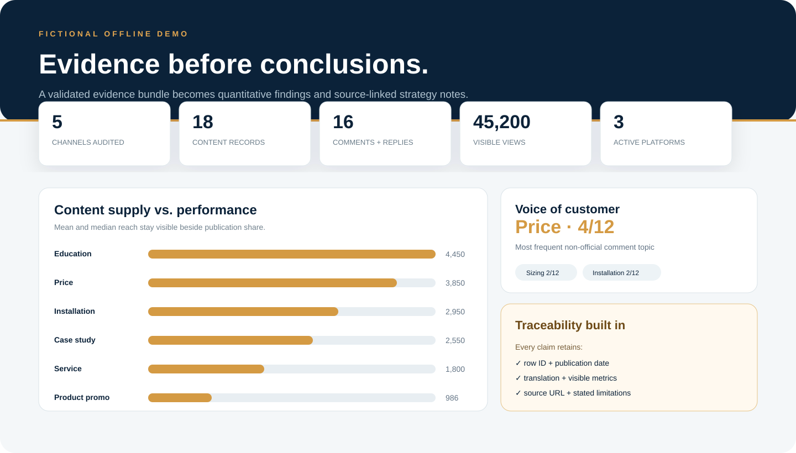

<p align="center">
  
</p>

<p align="center">
  <a href="https://github.com/KayZhongyi/competitor-census/actions/workflows/ci.yml"></a>
  <a href="LICENSE"></a>
  <a href="https://github.com/KayZhongyi/competitor-census/stargazers"></a>
  <a href="README.zh-CN.md">中文</a>
</p>

**Competitor Census** is an agent skill and open toolkit that turns public competitor channels into a structured evidence bundle and an evidence-linked strategy report. v0.2 includes a live YouTube metadata adapter plus a zero-dependency offline demo.

It is built around one idea: **census first, conclusions second**. Discover the channels that matter, capture the in-scope public corpus, preserve dates and engagement metrics, translate multilingual content, analyze patterns, and keep every claim traceable to its source.

> Public sources → platform census → in-scope capture → translation → evidence-backed analysis → report

## Run it on a real YouTube channel

Install the current [`yt-dlp`](https://github.com/yt-dlp/yt-dlp/wiki/Installation) release, then start with a small public-metadata run:

```bash
git clone https://github.com/KayZhongyi/competitor-census.git
cd competitor-census
python3 -m pip install -U "yt-dlp[default]"
python3 scripts/collect_youtube.py \
  --company "OpenAI" \
  --channel "https://www.youtube.com/@OpenAI" \
  --tabs videos \
  --max-items-per-tab 10
```

Open `runs/openai/report.html`. The same run also writes normalized CSV evidence, a JSON summary, and a scope/limitations manifest. Replace the company and channel values with your target after the trial.

<p align="center">
  
</p>

For a best-effort census of every retrievable item in the selected public tabs:

```bash
python3 scripts/collect_youtube.py \
  --company "Target Company" \
  --channel "https://www.youtube.com/@TargetHandle" \
  --tabs videos,shorts,streams \
  --max-items-per-tab 0
```

The adapter opens public video metadata but never downloads the media. It captures stable ID, publication date, title and description, duration, views, likes, visible comment count, channel identity fields, availability, and source URL where available. Large histories take time; platform-visible fields can be blank.

It deliberately leaves translation and content type unclassified. The Agent derives those fields from the real corpus instead of forcing preset keyword labels.

## See the offline demo in 60 seconds

No API key, browser login, or package install is required:

```bash
git clone https://github.com/KayZhongyi/competitor-census.git
cd competitor-census
python3 scripts/run_demo.py
```

Open `demo/output/report.html`, or view the [live fictional report](https://kayzhongyi.github.io/competitor-census/).

<p align="center">
  
</p>

## Why this is different

| Typical AI competitor research | Competitor Census |
|---|---|
| Starts with a familiar platform | Audits channels before choosing which ones to deep-dive |
| Samples a few posts | Captures the best-effort in-scope public corpus at a stated cutoff |
| Mixes source data and conclusions | Keeps an evidence bundle separate from the report |
| Uses preset labels | Derives categories from the actual corpus |
| Produces plausible prose | Attaches counts, denominators, row IDs, and source links |
| Treats automation as unlimited | Pauses for human verification and respects platform controls |

## What the workflow captures

For public content, the standard schema preserves:

- platform, account, stable ID, publication date, original text, and source URL;
- translation, media/content type, and visible brand/product references;
- views/plays, likes, comments, shares, and platform-native interaction data;
- public comments, commenter type when supportable, official replies, and response patterns;
- collection cutoff, coverage, failures, and known limitations.

The output is two deliverables—not one blended document:

1. **Evidence bundle:** platform census, content, comments, and a run manifest.
2. **Decision report:** executive brief, content mix, customer questions, performance gaps, response behavior, opportunities, and linked evidence.

## Install as an agent skill

### Codex

```bash
git clone https://github.com/KayZhongyi/competitor-census.git ~/.codex/skills/competitor-census
```

Then ask:

```text
Use $competitor-census to research the public channels of [company] in [market].
Build the evidence bundle first, then write a traceable strategy report.
```

### Claude Code

```bash
git clone https://github.com/KayZhongyi/competitor-census.git ~/.claude/skills/competitor-census
```

The workflow is plain Markdown plus Python standard-library tooling, so it can also be read by other terminal- and browser-capable agents.

## Analysis methods included

- **Emergent taxonomy:** categories come from repeated meanings in the corpus.
- **Coverage–performance gap:** publishing share is compared with mean and median reach.
- **Voice of customer:** concrete needs are counted with `n/N`, not summarized vaguely.
- **Response-pattern analysis:** useful answers, templates, redirection, and silence are separated.
- **Opportunity mapping:** high-demand/low-supply topics become testable opportunities.
- **Evidence thresholds:** small or ambiguous samples are labeled instead of overclaimed.

The detailed method lives in [`references/analysis-playbook.md`](references/analysis-playbook.md).

## Repository map

```text
competitor-census/
├── SKILL.md                         # Agent workflow and quality gates
├── agents/openai.yaml               # Codex skill metadata
├── demo/input/                      # Fictional, public-safe evidence bundle
├── scripts/collect_youtube.py       # Live public YouTube metadata adapter
├── scripts/run_demo.py              # Generic evidence validator/report generator
├── references/
│   ├── analysis-playbook.md
│   ├── collection-safety.md
│   ├── data-schema.md
│   └── youtube-adapter.md
├── tests/
└── docs/                             # GitHub Pages demo output
```

## Live collection stays adapter-based

The YouTube adapter is the first working reference implementation. Other sources connect through an authorized browser, API, export, or organization-approved collector and write normalized output to the same CSV schema. This keeps the analysis/report layer portable across regions, languages, platforms, and AI agents.

The project does **not** bypass CAPTCHA, authentication, rate limits, or platform safeguards. A “census” means a best-effort capture of the declared, publicly visible scope—not hidden, deleted, personalized, or restricted data.

## Roadmap

- [x] Live YouTube public-metadata adapter
- [ ] Generic adapter interface and starter browser collectors
- [ ] Incremental update and change-detection mode
- [ ] Pluggable translation and classification providers
- [ ] DOCX/PDF report themes
- [ ] Cross-competitor comparison after individual dossiers are complete

Contributions are welcome, especially public-safe adapters and report themes. See [CONTRIBUTING.md](CONTRIBUTING.md).

## License

[MIT](LICENSE). The demo company and every demo record are fictional. No employer, client, or real-user dataset is included.
